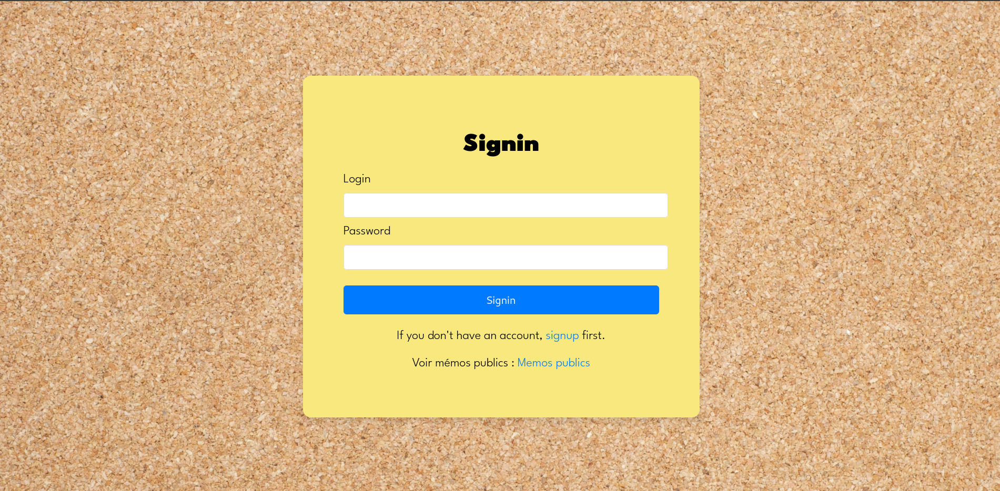
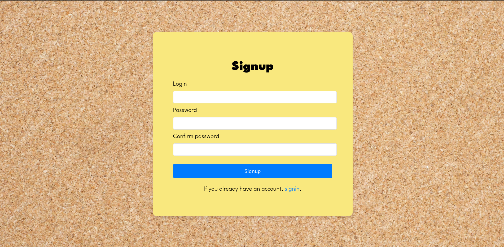
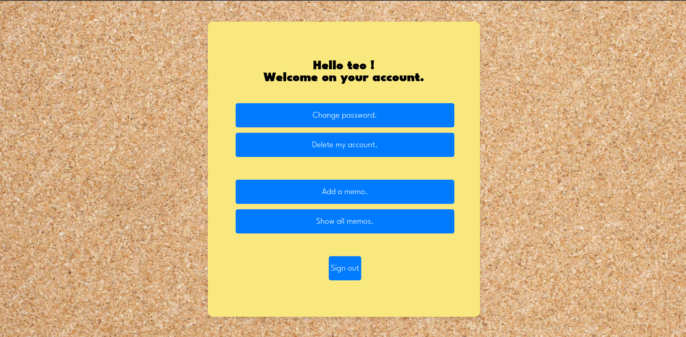
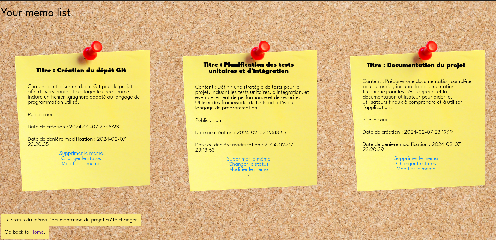

# Projet Laravel 


Ce projet, réalisé avec le framework Laravel, constitue une application web dédiée à la gestion de mémos personnels et partagés.
Les utilisateurs ont la possibilité de s'inscrire, se connecter, et d'interagir avec une interface intuitive pour gérer leurs informations personnelles et memos.

Une fois connectés, les utilisateurs peuvent facilement ajouter, consulter, éditer ou supprimer des mémos. Le système offre également la possibilité de modifier les paramètres de compte, y compris le mot de passe. Un aspect central de l'application est la gestion de la visibilité des mémos : chaque mémo peut être défini comme public ou privé, ce qui enrichit les possibilités de partage d'informations au sein de l'application.
Les visiteurs non connectés peuvent accéder et visualiser les mémos publics dès la page de connexion et les consulter en détails.

Conçu dans le cadre du module W31 de ma deuxième année en BUT informatique, ce projet facultatif visait à approfondir nos compétences en développement web à travers l'exploration de Laravel, tout en préparant efficacement les évaluations à venir.

## Présentation du Projet

### Écran de Connexion



Sur cet écran, les utilisateurs peuvent se connecter à leur compte en utilisant leur login et mot de passe. Les mémos publics sont également consultables depuis cette page.

### Écran d'Inscription



Permet aux nouveaux utilisateurs de créer un compte en fournissant un login et un mot de passe.

### Dashboard Utilisateur



Après connexion, les utilisateurs accèdent à leur dashboard où ils peuvent voir leurs mémos, ajouter un mémo, modifier leur mot de passe ou supprimer leur compte.

### Gestion des Mémos



Les utilisateurs peuvent consulter la liste de leurs mémos, et modifier le statut d'un mémo (public ou privé). Ils peuvent également modifier ou supprimer leurs mémos.

## Configuration et Installation

### Prérequis

Avant de commencer, assurez-vous que vous avez installé sur votre système :

- PHP >= 7.3
- [Composer](https://getcomposer.org/)
- Laravel >= 8.0
- Une base de données (MySQL, SQLite, etc.)

### Installation

1. **Cloner le dépôt**

   Pour commencer, clonez ce dépôt sur votre machine locale en utilisant la commande suivante :

   ```bash
   git clone https://github.com/TeHozen/projet_w31.git

1. **Installer les dépendances PHP**

   Accédez au répertoire du projet cloné et installez les dépendances PHP en utilisant Composer :

   ```bash
   cd projet_w31/projet/
   composer install

1. **Configurer le fichier .env**

   Copiez le fichier .env.example pour créer votre propre fichier .env, qui contiendra vos configurations spécifiques :

   ```bash
   cp .env.example .env
   ```
   Ensuite, ouvrez le fichier .env avec votre éditeur de texte préféré et configurez les paramètres de votre environnement, notamment les détails de la base de données. Une base de données d'exemple est déjà présente, il faut juste spécifier le chemin vers la bdd.
   

4. **Générer une clé d'application**

   Laravel nécessite une clé d'application unique pour sécuriser les sessions et les données cryptées. Générez cette clé en utilisant :

   ```bash
   php artisan key:generate

1. **Exécuter les migrations**

   Ce projet est fourni avec une base de données pré-remplie d'exemples pour vous permettre de tester directement différentes fonctionnalités sans avoir à créer de données depuis le début. Si, à un certain moment, vous souhaitez réinitialiser la base de données à son état initial, vous pouvez utiliser la commande `migrate:refresh` d'Artisan. Cette commande va réinitialiser votre base de données en annulant toutes les migrations existantes et en les réexécutant :

   ```bash
   php artisan migrate:refresh

1. **Lancer le serveur**

   Cela démarrera un serveur de développement sur http://localhost:8000. Ouvrez cette URL dans votre navigateur pour voir l'application.

   ```bash
   php artisan serve